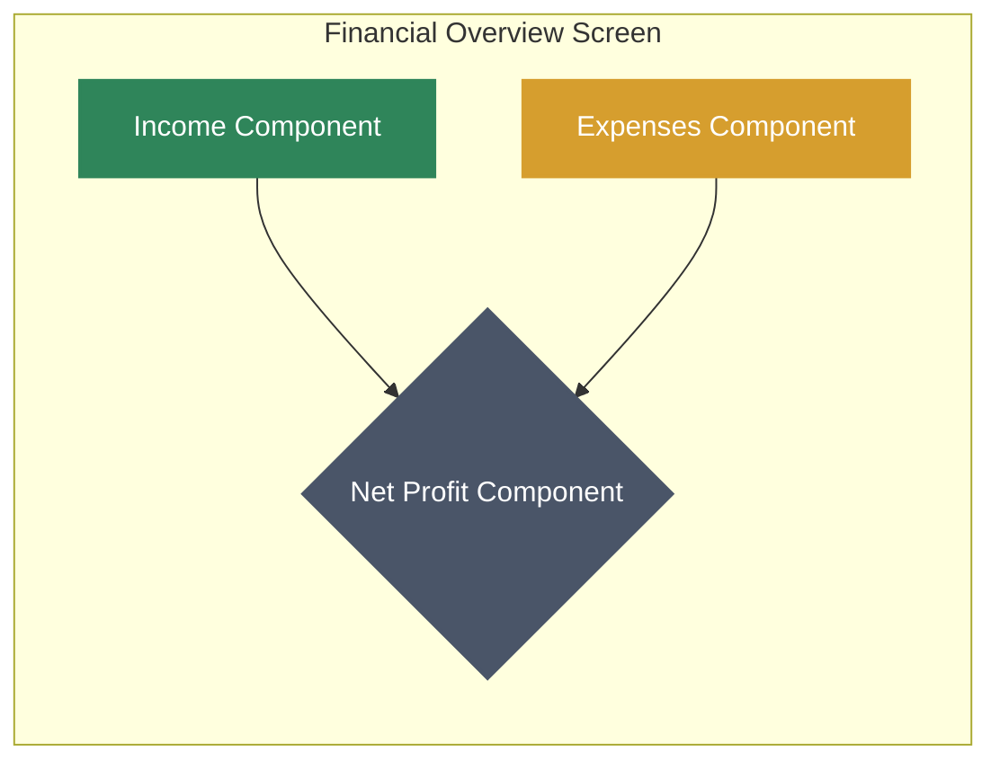

# Financial Overview Screen Redesign: "Financial Flow" Concept

## 1. Core Concept & Rationale

The "Financial Flow" concept redesigns the financial overview screen to be more than just a set of numbers. It aims to provide an intuitive, at-a-glance understanding of the school's financial health by establishing a clear visual narrative.

The primary rationale is to solve the following problems with the current design:
*   **Lack of Context:** Single numbers for income, expenses, and profit are meaningless without comparison points.
*   **No Visual Hierarchy:** All metrics are presented with equal importance, failing to guide the user's focus to the most critical metric: Net Profit.
*   **Static and Unengaging:** The design doesn't communicate trends or the dynamic relationship between financial components.

This new design uses a **hierarchical layout** and **micro-visualizations** to show how money *flows* from income, through expenses, to the resulting net profit.

## 2. Layout & Visual Hierarchy

The screen will be organized vertically to create a clear information flow. The aesthetic will be a clean, modern **glassmorphism** style, using blurred, semi-transparent backgrounds for components to create a sense of depth and focus on a dark, professional background.

*   **Net Profit (Primary Focus):** This component will be the largest and most prominent, positioned at the bottom or center of the screen, serving as the ultimate result of the other two metrics.
*   **Income & Expenses (Inputs):** These two components will be positioned above the Net Profit component, visually "feeding" into it. Subtle, animated lines will connect them to the Net Profit block to reinforce the flow concept.

## 3. Component Breakdown

Each component will be a "glass" card—a container with a blurred background and a soft, semi-transparent border.

### A. Net Profit Component (The Result)

*   **Primary Value:** The largest text on the screen (e.g., `$12,450`). The color will be dynamic: green for positive profit, amber/orange for a loss.
*   **Label:** "Net Profit" in a clean, medium-weight font.
*   **Contextual Data:** A smaller label below the primary value showing the percentage change from the previous period (e.g., `+12.5% vs. last month`). An icon (`trending-up` or `trending-down`) will accompany this.
*   **Micro-Visualization:** A **sparkline chart** will be embedded at the bottom of the card, showing the profit trend over the selected time period.

### B. Income Component (The Inflow)

*   **Primary Value:** Total income (e.g., `$45,000`).
*   **Label:** "Total Income".
*   **Contextual Data:** Percentage change from the previous period (e.g., `+8.2%`).
*   **Micro-Visualization:** A compact **horizontal bar chart** showing the top 2-3 income categories (e.g., "Tuition Fees", "Donations"). This provides an immediate breakdown without needing to navigate away.

### C. Expenses Component (The Outflow)

*   **Primary Value:** Total expenses (e.g., `$32,550`).
*   **Label:** "Total Expenses".
*   **Contextual Data:** Percentage change from the previous period (e.g., `+4.1%`).
*   **Micro-Visualization:** A compact **horizontal bar chart** similar to the income component, showing the top 2-3 expense categories (e.g., "Salaries", "Utilities").

## 4. Visual Design System

*   **Color Palette:**
    *   **Background:** Dark, desaturated blue/gray (`#1A202C`).
    *   **Income/Positive:** Calming, strong green (`#48BB78`).
    *   **Expenses/Negative:** Muted, warm amber (`#F6AD55`).
    *   **Net Profit:** White (`#FFFFFF`) for the primary value to make it stand out. Trend lines and contextual data will use the green/amber colors.
    *   **Text & Icons:** Light gray (`#E2E8F0`) for general text and icons to ensure readability against the dark background.
    *   **Glass Effect:** Component backgrounds will use a semi-transparent white (`rgba(255, 255, 255, 0.1)`) with a backdrop blur effect.

*   **Typography:**
    *   **Font:** A modern, clean sans-serif like **Inter** or **Poppins**.
    *   **Primary Values:** `Poppins Bold`, 36pt.
    *   **Labels:** `Inter Medium`, 14pt.
    *   **Contextual Data & Chart Labels:** `Inter Regular`, 12pt.

*   **Iconography:**
    *   Use a clean, minimalist icon set like **Feather Icons**.
    *   **Income:** `arrow-down-circle`
    *   **Expenses:** `arrow-up-circle`
    *   **Profit Trend:** `trending-up` / `trending-down`

This design system ensures the UI is not only beautiful and modern but also highly functional, providing deep financial insight in a format that is quick to scan and easy to comprehend.