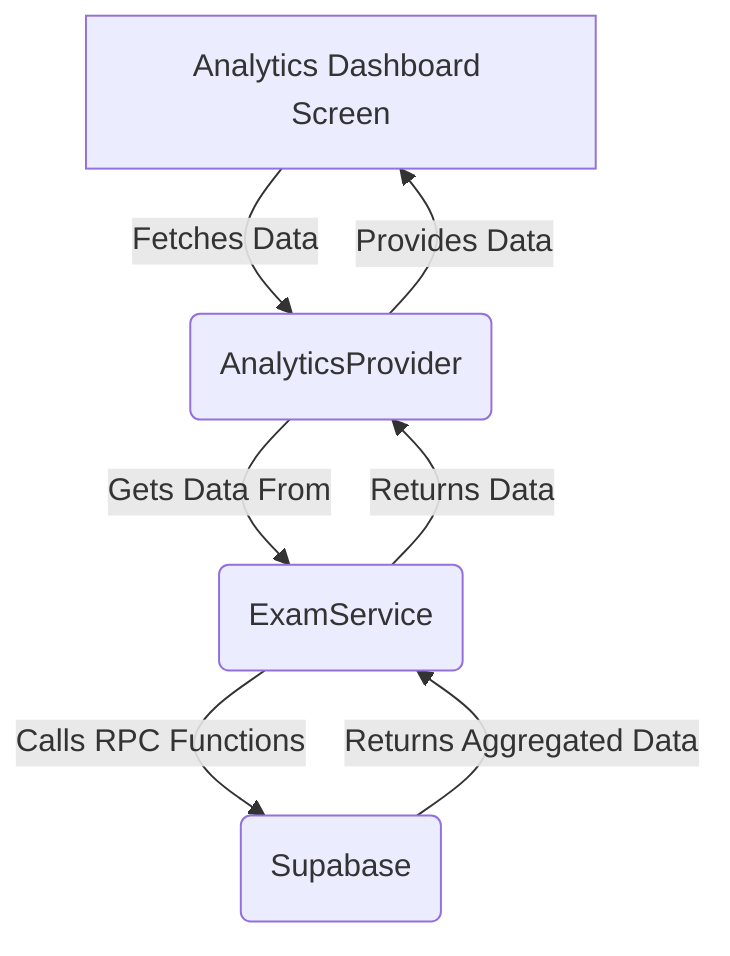

# Analytics Dashboard Architecture

This document outlines the architecture for the new Analytics Dashboard feature.

## 1. High-Level Architecture

The Analytics Dashboard will be a new screen in the app that is accessible to administrators and teachers. It will fetch aggregated data from Supabase and display it using various charts and widgets.

## 2. User Roles and Permissions

The dashboard will display different data depending on the user's role:

*   **Admin:** Can view analytics for the entire school, including all classes and subjects. They can compare performance across different classes.
*   **Teacher:** Can only view analytics for the classes and subjects they are assigned to.

This will be implemented by passing the user's role and ID to the data fetching methods, which will then filter the data accordingly.

## 3. Dashboard Structure

The dashboard will be divided into the following sections:

*   **Overall Performance:** Displays key metrics for the entire school or a specific class, such as average marks, pass/fail rates, and top-performing students.
*   **Subject Analysis:** Provides a breakdown of performance by subject, showing average marks, pass rates, and grade distribution for each subject.
*   **Student Progress:** Tracks the performance of individual students over time, showing their marks in different exams and subjects.

## 4. Key Metrics and Visualizations

The following metrics and visualizations will be included in the dashboard:

| Metric                  | Visualization      | Description                                                              |
| ----------------------- | ------------------ | ------------------------------------------------------------------------ |
| Average Marks           | Bar Chart          | Average marks per subject or class.                                      |
| Pass/Fail Rate          | Pie Chart          | Percentage of students who passed or failed an exam.                     |
| Grade Distribution      | Bar Chart          | Number of students who received each grade (e.g., A, B, C).              |
| Student Performance     | Data Table         | List of students with their total marks, percentage, and rank.           |
| Student Progress        | Line Chart         | A student's marks in a specific subject over multiple exams.             |
